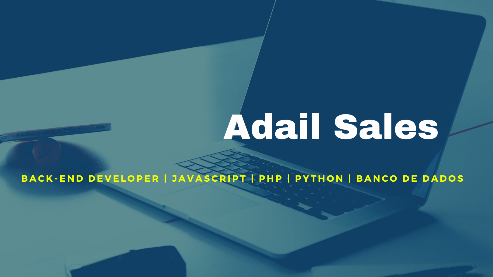

### 👋 Olá, eu me chamo Adail e geralmente me descrevo como sendo um desenvolvedor back-end. A verdade é que eu me identifico com o conceito de profissional em T. 

Quando menciono que me identifico com o conceito de profissional em T significa que a ideia aqui é ter um conjunto de habilidades e conhecimentos gerais que permitam com que possamos desenvolver nossas capacidades de empatia e pensamento abstrato de forma a criarmos times mais colaborativos e criativos.

Como venho de uma formação em Letras que por natureza é uma área multidisciplinar que faz contato com a Psicologia, Filosofia, Ciências Sociais, Lógica, entre outras não posso deixar este conhecimento de lado e parto para aplicar ferramentas que já conheço em novas situações de uso. Esta é uma das habilidades que destaca o profissional em T.

Desta forma, posso afirmar que tenho um perfil que tende mais para o desenvolvedor generalista do que o especialista e isso pode ser levemente contemplado até mesmo pelo número de linguagens de programação que já tive contato e que desenvolvi alguns projetos, são elas: JavaScript, PHP, Python, Ruby, Lua e Shell Script.

O profissional em T (em seu traço horizontal) possui um olhar amplo e generalista, pensamento e capacidade de colaboração multifuncional e ainda aprofunda (em seu traço vertical) uma especialidade. Para mim, esse modelo é um salto quântico em relação ao modelo puramente especialista ou puramente generalista. O processo de desenvolvimento é um trabalho colaborativo, iterativo e criativo, no qual times multifuncionais são essenciais e devem acompanhar cada funcionalidade a ser colocada em produção, o que é muito adequado para este tipo de profissional multidisciplinar. Um mundo dinâmico, ultraconectado pede profissionais em T.

<!--
**AdailSales/AdailSales** is a ✨ _special_ ✨ repository because its `README.md` (this file) appears on your GitHub profile.

Here are some ideas to get you started:

- 🔭 I’m currently working on ...
- 🌱 I’m currently learning ...
- 👯 I’m looking to collaborate on ...
- 🤔 I’m looking for help with ...
- 💬 Ask me about ...
- 📫 How to reach me: ...
- 😄 Pronouns: ...
- ⚡ Fun fact: ...
-->

## Sobre mim (abstract)
👨‍🏫 Atualmente trabalho como professor de Língua Portuguesa.

🐍 Interessado nos seguintes temas: Clean Code, Agile Software, TDD (Desenvolvimento Orientado a Testes).

📚 Atualmente estudando PHP, Laravel e Banco de dados.

💻 Tenho um canal no YouTube em que transmito as aulas de programação do curso no qual sou facilitador.

## Hobbies

🎥 Sou realizador audiovisual, já dirigi e produzi alguns curtas.

📺 Gosto de assistir séries e animes.

🏃‍♂️ Pratico corrida.

🧘‍♂️ Gosto de dedicar um tempo para meditar e praticar yoga.

## Principais projetos 

Em construção.
